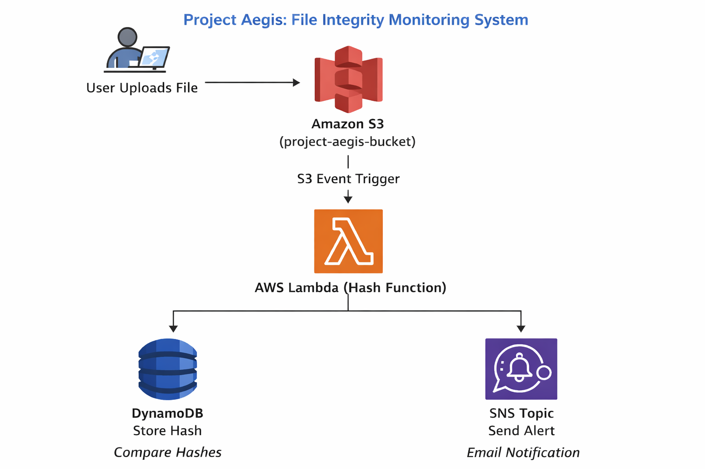
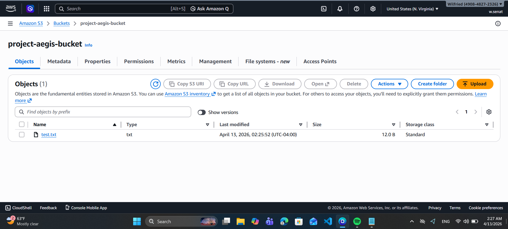
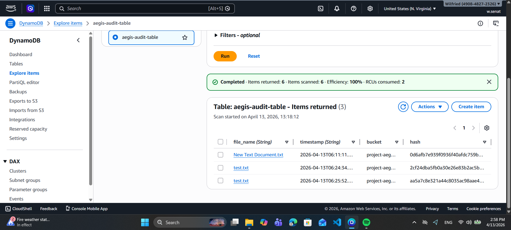
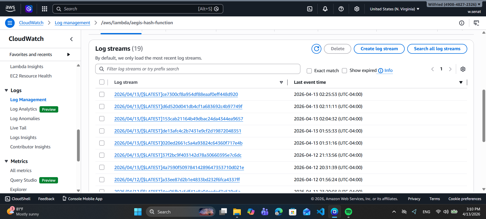
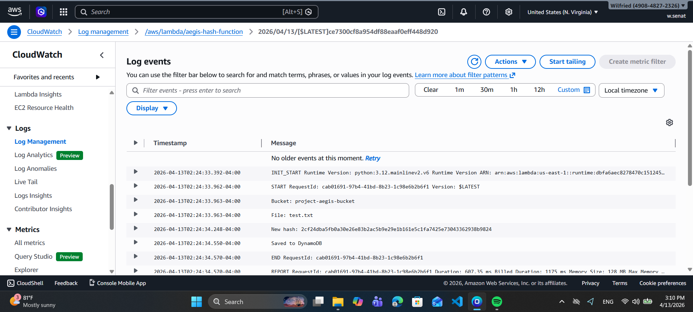
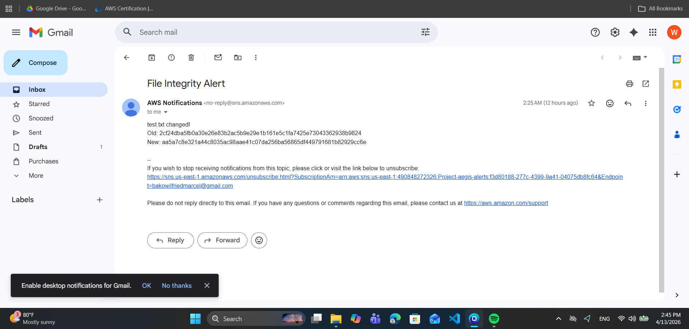

# 🛡️ Project Aegis – The Immutable Audit Vault

##  Overview

Project Aegis is a cloud native file integrity monitoring system designed to ensure authenticity, traceability, and security of uploaded files.
It automatically generates a SHA-256 fingerprint for every file stored in Amazon S3 and maintains a tamper proof audit trail in DynamoDB. If a file is modified while keeping the same name, the system detects the change and triggers a real time alert using Amazon SNS.
This project was first built manually using the AWS Console and later automated using Terraform to demonstrate Infrastructure as Code practices.

This project simulates high stakes environments such as legal, medical, and forensic systems where data integrity is critical.

 Serverless AWS security system that detects file tampering in real time using SHA-256 hashing, DynamoDB audit logs, and SNS alerts.
---

##  Architecture



---
##  Architecture Highlights

- Event driven serverless pipeline  
- Real time file integrity monitoring using SHA-256  
- Scalable audit logging with DynamoDB  
- Decoupled alerting using SNS  
- Secure IAM least privilege design  

##  Technical Stack

- Amazon S3 – Object storage with event triggers  
- AWS Lambda (Python) – Serverless compute for hashing and logic  
- Python (hashlib, boto3) – SHA-256 hashing and AWS SDK  
- Amazon DynamoDB – Stores file metadata and hash history  
- Amazon SNS – Sends real-time email alerts  
- Amazon CloudWatch – Logging and monitoring  
- IAM Roles & Policies – Secure service permissions  

---

##  Workflow

1. User uploads a file to Amazon S3  
2. S3 triggers the Lambda function  
3. Lambda:
   - Retrieves the file
   - Generates SHA-256 hash
   - Queries DynamoDB for previous hash
4. If hash is different:
   - Sends alert via SNS
5. Stores new hash in DynamoDB  

---

##  Security Logic

- Same filename + different content =  ALERT  
- Same filename + same content =  No alert  

---

##  Testing Scenario

### Step 1
Upload file:
test.txt → hello


### Step 2
Modify file:
test.txt → HELLO WORLD 123456


### Result
- Hash changes  
- SNS email alert triggered  
- DynamoDB updated  

---

##  Key Features
- Serverless architecture  
- Real time event-driven processing  
- File integrity verification using SHA-256  
- Automated alerting system  
- Historical tracking using DynamoDB  

---

##  Project Structure

project-aegis/
│
├── lambda/
│ └── lambda_function.py
│
├── architecture/
│ └── diagram.png
│
├── screenshots/
│ ├── s3-upload.png
│ ├── dynamodb.png
│ ├── cloudwatch.png
│ └── sns-alert.png
│
└── README.md
##  IAM Permissions Required

```json
{
  "Effect": "Allow",
  "Action": [
    "s3:GetObject",
    "s3:ListBucket",
    "dynamodb:PutItem",
    "dynamodb:Query",
    "sns:Publish"
  ],
  "Resource": "*"
}
```

##  IAM Permissions Required (Lambda Role)

This policy allows Lambda to:
- Read files from S3
- Store hashes in DynamoDB
- Send alerts via SNS

## 📸 Screenshots

### S3 Upload Trigger


### DynamoDB Records


### CloudWatch Logs



### SNS Alert Email



##  How to Run This Project (Manual Setup )

###  Create S3 Bucket

- Go to AWS Console → S3 → Create bucket  
- Bucket name: `project-aegis-bucket`  
- Region: same as Lambda (important)  
- Enable:
  -  Versioning  
- Keep other settings default  
- Click **Create bucket**

---

###  Create DynamoDB Table

- Go to DynamoDB → Create table  
- Table name: `aegis-audit-table`  
- Partition key:
  - `file_name` (String)  
- Leave default settings  
- Click **Create table**

---

###  Create SNS Topic

- Go to SNS → Topics → Create topic  
- Type: Standard  
- Name: `Project-aegis-alerts`  

#### Add Subscription:
- Protocol: Email  
- Endpoint: your email  
- Click **Create subscription**

📩 Check your email and **CONFIRM subscription**

---

###  Create IAM Role for Lambda

- Go to IAM → Roles → Create role  
- Select: **Lambda**  
- Attach policy (custom or inline):

```json
{
  "Version": "2012-10-17",
  "Statement": [
    {
      "Effect": "Allow",
      "Action": ["s3:GetObject", "s3:ListBucket"],
      "Resource": [
        "arn:aws:s3:::project-aegis-bucket",
        "arn:aws:s3:::project-aegis-bucket/*"
      ]
    },
    {
      "Effect": "Allow",
      "Action": [
        "dynamodb:PutItem",
        "dynamodb:Query"
      ],
      "Resource": "arn:aws:dynamodb:*:*:table/aegis-audit-table"
    },
    {
      "Effect": "Allow",
      "Action": "sns:Publish",
      "Resource": "*"
    }
  ]
}
```

- Name the role: `aegis-lambda-role`

---

###  Create Lambda Function

- Go to Lambda → Create function  
- Name: `aegis-hash-function`  
- Runtime: **Python 3.12**  
- Execution role: use existing role → `aegis-lambda-role`  

#### Add Environment Variables:
- `TABLE_NAME = aegis-audit-table`  
- `SNS_TOPIC_ARN = <arn:aws:sns:us-east-1:490848272326:Project-aegis-alerts>`  

---

### Deploy Lambda Code

- Upload your `lambda_function.py`  
- Click **Deploy**

---

### Add S3 Trigger

- Open your Lambda → Add trigger  
- Select: S3  
- Bucket: `project-aegis-bucket`  
- Event type: **All object create events**  
- Enable trigger  

---

### Test the System

#### Test 1: No Alert
1. Create file locally:
   - `test.txt` → content: `hello`  
2. Upload to S3  
3. Upload same file again (same content)  

Result:
- Stored in DynamoDB  
- No SNS alert  

---

####  Test 2: Trigger Alert
1. Edit file:
   - `test.txt` → `HELLO WORLD 123`  
2. Upload again with SAME name  

Result:
- New hash generated  
- DynamoDB updated  
- SNS email alert received  

---

### Verify Logs (CloudWatch)

- Go to CloudWatch → Logs → Lambda logs  
- Confirm:
  - File processed  
  - Hash generated  
  - SNS triggered
 
 ---

  ##  Infrastructure as Code (Terraform)

This project was initially built using the AWS Console and later fully automated using Terraform to demonstrate Infrastructure as Code (IaC) best practices.

The Terraform configuration provisions the entire system automatically, including:

* S3 bucket with Object Lock and versioning (immutable storage)
* DynamoDB table with partition and sort key for audit history
* SNS topic with email subscription for alerts
* Lambda function deployment (via ZIP packaging)
* IAM roles and policies with least privilege
* S3 event trigger to invoke Lambda automatically

---

##  Terraform Structure

project-aegis/
├── terraform/
│   └── main.tf
├── lambda/
│   └── lambda_function.py

---

## ⚙️ Deployment Steps (Terraform)

### Step 1 — Configure AWS CLI

Run:
aws configure

Enter:

* Access key
* Secret key
* Region (e.g. us-east-1)

---

### Step 2 — Go to Terraform folder

cd terraform

---

### Step 3 — Initialize Terraform

terraform init

---

###  Screenshot — Terraform Init


---

### Step 4 — Preview changes

terraform plan

---

###  Screenshot — Terraform Plan

(Add screenshot here)

---

### Step 5 — Package Lambda

Go back to project root and run:

powershell Compress-Archive -Path lambda_function.py -DestinationPath lambda.zip -Force

---

### 📸 Screenshot — Lambda ZIP (optional)

---

### Step 6 — Deploy infrastructure

terraform apply

Type: yes

---

###  Screenshot — Terraform Apply

(Add screenshot here)

---

### Step 7 — Confirm SNS email

Check your email and confirm subscription.

---

###  Screenshot — SNS Confirmation Email

---

### Step 8 — Test system

Upload file:
test.txt → hello

Upload modified file:
test.txt → HELLO WORLD

Expected:

* No alert first time
* Alert when content changes

---

###  Screenshot — SNS Alert Email

---

##  Manual vs Terraform

Manual:

* Click-based
* Hard to repeat
* Slower

Terraform:

* Code-based
* Reproducible
* Fast deployment

---

##  Key Insight

Terraform allows this entire system to be recreated quickly, ensuring consistency and scalability across environments.


---

## Expected Outcome
- Every file upload is tracked  
- Same file content → no alert  
- Modified file →  alert triggered  
- Full audit trail stored in DynamoDB  
 
##  Challenges & Solutions

### 1. Duplicate File Detection
- **Problem:** Uploading files with the same name triggered unnecessary alerts  
- **Root Cause:** Initial logic compared filenames only  
- **Solution:** Implemented SHA-256 hashing to compare file content instead  
- **Result:** Alerts are triggered only when actual file content changes  

---

### 2. SNS Alerts Not Triggering
- **Problem:** No alerts were received even after modifying files  
- **Root Cause:** Missing SNS publish logic and incorrect Lambda permissions  
- **Solution:** Added `sns:Publish` permission and integrated SNS logic in Lambda  
- **Result:** Real-time email alerts now trigger correctly  

---

### 3. S3 Overwrite Behavior Confusion
- **Problem:** Uploading same filename replaced existing file instead of creating a new one  
- **Root Cause:** S3 overwrites objects with identical keys by default  
- **Solution:** Leveraged hash comparison instead of relying on file versions  
- **Result:** System accurately detects changes even when files are overwritten  

---

### 4. Broken Image Paths in README
- **Problem:** Screenshots were not displaying in GitHub  
- **Root Cause:** Incorrect file paths  
- **Solution:** Fixed paths using `screenshots/filename.png`  
- **Result:** Proper visualization of architecture and results  

---

### 5. Debugging with CloudWatch
- **Problem:** Difficult to verify if Lambda executed correctly  
- **Solution:** Used CloudWatch logs to trace execution flow and debug issues  
- **Result:** Improved reliability and troubleshooting capability  

##  What I Learned

- How to design event-driven serverless architectures using AWS  
- Implementing file integrity checks using SHA-256 hashing  
- Integrating multiple AWS services (S3, Lambda, DynamoDB, SNS)  
- Debugging real world cloud issues using CloudWatch logs  
- Managing IAM roles and permissions securely (least privilege)  
- Handling edge cases like duplicate files and overwrite behavior  
- Building production like systems with monitoring and alerting  

##  Future Improvements

- Add API Gateway for secure file upload interface  
- Implement user authentication using Amazon Cognito  
- Store audit logs in S3 for long-term archival  
- Build a monitoring dashboard using Grafana or QuickSight  
- Add support for multi region replication for disaster recovery  
- Implement automated infrastructure deployment using Terraform  
- Add checksum comparison for large files using streaming  

## 👤 Author

**Wilfried Bako**

- LinkedIn: https://linkedin.com/in/wilfriedbako
-  GitHub: https://[[github.com/YOUR-GITHUB  ](https://github.com/wilfriedbako)]
